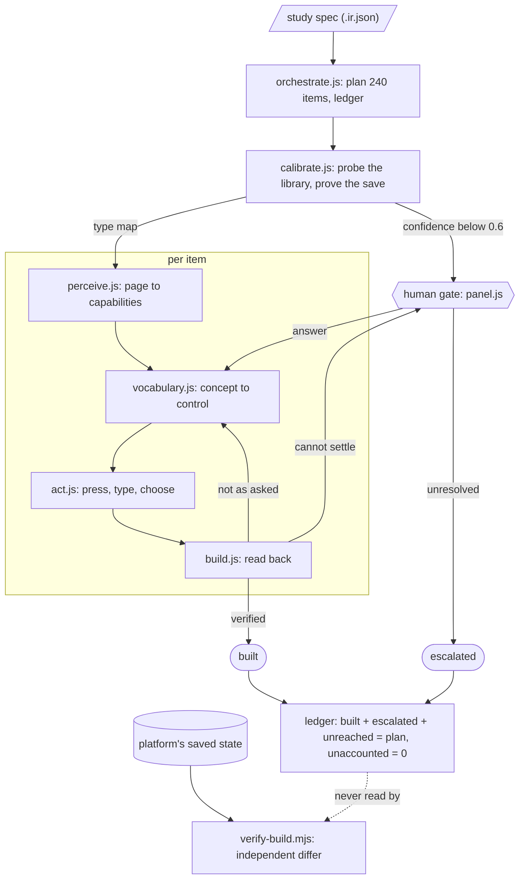

<div align="center">


# Tob the Trial Builder

*It has never seen this platform. It builds the study anyway, and tells you what it could not.*

[Setup](#setup) · [How It Works](#how-it-works) · [Architecture](#architecture) · [Type Mapping](#type-mapping) · [Human Gate](#the-human-gate) · [Evidence](#evidence) · [Limits](#where-it-breaks)

Tob is a Chrome extension that reads a study specification and builds it into whatever eSource form designer happens to be open in the tab, with **no prior knowledge of that platform**. There are no selectors, no class names and no vendor wording anywhere in `src/`. It perceives the page as **capabilities** rather than markup, **runs an experiment** to learn the platform's element library instead of matching names, and keeps a **ledger** in which an item counts as built only after the platform has been read back and agreed. Anything it cannot settle honestly becomes a **question for a human**, never a silent guess.

Built against **four independent designers**: the assignment's own and three others, only one of which this project wrote. On each it builds ABC-101 complete, **4 visits · 28 forms · 195 fields · 13 display rules**, checked field by field by a differ that does not trust the agent.

**No API key. No network calls. Deterministic code, not a model in a loop.**

</div>

---

<!-- demo gif -->

---

## Setup

```bash
npm install && npm run build      # bundles src/ into dist/
npm test                          # 80 unit tests; 5 skip without the spec below
npm run mock                      # a designer to build into, on :5174
```

Chrome → `chrome://extensions` → Developer mode → **Load unpacked** → `dist/`.
Open a designer in a tab, click the Tob icon, choose `abc-101-study.ir.json`, then **Build into this tab**. The agent is injected at run time, so a tab opened before installing does not need reloading.

> **Not in this repository.** The study specification and the assignment's own mock are the assignment's material, so neither is published here. Everything still runs: tests needing the spec skip and say so, and `mocks/meridian/` is a complete designer written for this project that ships.

---

## How It Works

`perceive → decide → act → confirm`, looping, with **confirm** doing the real work.

| Stage | What happens |
|---|---|
| **Perceive** | The page becomes a list of controls, each with a *capability* (TOGGLE / CHOOSER / TEXT / ACTION / OPTION), an accessible name computed as a screen reader would, and the headings that scope it. The only selectors in `src/` are standard HTML and ARIA. Nothing above this module knows what a `<div>` is. |
| **Decide** | Concepts (`commit`, `label`, `minimum`, `visibility`) in ordinary English with **strong, weak and negative** terms. The costly mistake is not "found nothing", it is "found something that looked right", so `Save As Template` ranks *below* a control with no matching words. A tie returns `null`, because a tie is a question. |
| **Act** | Every control is re-resolved immediately before use. A node reference is a snapshot, not a handle, and a designer that re-renders hands back a detached element. |
| **Confirm** | Nothing counts because it was clicked. Fields are read back off the saved form, and a form counts only after a commit *proved* to persist. |

**The ledger.** A plan of 240 items is derived from the specification before anything is touched. `built + escalated + unreached = plan`, and `unaccounted` must be 0. These are shown separately, never summed into one reassuring number.

Its limit, found the hard way: it counts *planned* items, so it cannot see what should not be there. It once reported 28 forms built when 17 existed. That was caught by `verify-build.mjs`, not by the ledger.

---

## Architecture



The dotted line is the point. The differ reads the **platform's** saved state, never the agent's account of itself. It has disagreed with the agent repeatedly and has always been right.

---

## Type Mapping

The same canonical type is called something different on every platform. **This table is what the agent worked out, not what it was told.** None of these names appears anywhere in `src/`:

| canonical | Mock A | Designer B | Designer C | Meridian |
|---|---|---|---|---|
| `integer` | Number (Whole) | Tally Counter | Number | Whole Amount |
| `decimal` | Number (Decimal) | Measurement | Number (Precise) | Exact Amount |
| `checkbox` | Checkbox | Single Tick | Tick Box | Confirmation Mark |

String matching cannot survive that, so the agent **runs an experiment**. On entering a designer it presses every library entry once and records what *appeared*: a coded values editor? a min and max? a precision box? what does the field render as? Probes are removed before any real field is built. The margin between the top two candidates becomes a **confidence score**, and below 0.6 it goes to the gate.

Behaviour decides, and it outweighs wording by four to one:

```js
if (f.formula)   bump(['calculated'], 8);   // a formula box appeared
if (f.yesNo)     bump(['boolean'],    7);   // it renders yes/no controls
if (f.multiline) bump(['textarea'],   6);   // it renders multi-line text
…
for (const hint of hints) if (lowered.includes(hint)) s[type] += 1.5;   // a tie-break, no more
```

The word lists are ordinary English, `integer: ['integer','whole','count','tally','number']`, so `tally` fits "Tally Counter" for the same reason `whole` fits "Whole Amount": they are what people call whole numbers. Nothing is keyed to a product. The evidence that this is real is that Meridian scored **32/240 on first contact**. A hardcoded table would have given 240 at once, or 0 forever.

Two details that cost whole runs: diffs are by **semantic signature, not element identity**, because a page that rebuilds itself would otherwise report the whole screen as new; and a **properties panel is not a preview**, because a panel headed "Options" would make every field look like it has coded values.

**Finding the save** is the same problem. Every mock puts a decoy where a save belongs, such as `Save As Template` or `Store Draft Locally`, and two hide the real one in a `⋯` menu. So the agent plants a sentinel field, presses a candidate, leaves, returns, and checks it survived. A control that fails a round trip is not a save, whatever it is called.

---

## The Human Gate

**One calibration card, before anything is built.** It shows the whole type map with confidence and the evidence behind each row, such as `boolean → "Yes/No Toggle" (0.92), the field renders yes/no controls`. A reviewer asked 195 times learns to click through without reading. Each uncertain row carries a **dropdown of that platform's own entries**, so disagreeing costs one dropdown, not the run.

**Per-item escalations during the run**, never counted as built:

```
present, but this designer will not show formula: unverified
could not select the field to give it a rule; the panel is showing "Outcome"
```

On one designer it escalated exactly 7 formula fields, and the differ then found exactly those 7 wrong and nothing else. That match is the property worth having.

Progress reads `building… 142 of 240 · field "Vital Signs"`. It advances only when an item settles, so a stalled run looks stalled rather than busy.

---

## Evidence

**What makes it generalize** is everything above: capabilities instead of selectors, behaviour instead of names, a probe instead of a lookup table, and a read-back instead of a click. **What proves it** is a platform it has never seen, so here is one, run against unchanged.

`mocks/meridian/` is a fourth designer written from scratch: sidebar tree navigation, catalogue as a `role="listbox"`, `role="switch"` toggles, and a save called `Apply Changes` in an overflow menu.

| Stage | Result | What changed |
|---|---|---|
| First contact | **32 / 240** | nothing |
| after 4 agent fixes | **217 / 240** | see below |
| after 2 mock fixes | 240 built, 21 wrong types | the mock was being unfair |
| after 1 vocabulary fix | **240 / 240** | agent did not know `concealed` means hidden |

**32 to 217 is the agent improving; 217 to 240 is partly the mock getting fairer.** The four agent bugs were all general:

1. A record list read as a palette. Seven rows of three buttons is 21 controls but 3 distinct names, and a library offers a different *kind* per entry.
2. A study tree outscored the real catalogue. A tree lists what you already made, and the agent knows what it made.
3. `alreadyListed` answered from the whole page, including a sidebar naming every form. **The ledger recorded 28 forms built when 17 existed**, a false *built*, which is the worst failure available.
4. `buildField` could only press buttons, so a `role="option"` catalogue was understood and then unusable.

Meridian now passes, so it is a **regression test, not evidence**. A benchmark tuned until it passes proves nothing. The evidence is the three designers this project did not write.

| Platform | Written by | Ledger (headless) | Differ |
|---|---|---|---|
| the assignment's eSource mock | the assignment | 240 built · 0 escalated | **0 differences** |
| a second study designer | not this project | 240 built · 0 escalated | **0 differences** |
| a third study designer | not this project | 240 built · 0 escalated | **0 differences** |
| Meridian Clinical | this project | 240 built · 0 escalated | **0 differences** |

Chrome agrees, with the calibration accepted as proposed. **Disagree with it and the number moves, which is the point of having it.** Overriding the type map with deliberately wrong choices gave **204 built · 36 escalated · 0 unaccounted**, because a field given a type that cannot hold a minimum cannot then be given one. The ledger still reconciled, and the human who caused it was told which 36 and why.

```bash
npm test                                     # 80 unit tests (jsdom), ~4s
node test/surfaces.mjs all <spec.ir.json>    # every surface present, ~15 min
```

Headless is more forgiving than a browser. jsdom has no layout, so `test/surfaces.mjs` stubs `getBoundingClientRect`, and `isVisible` asks exactly that question. A control a browser hides by geometry alone looks visible under the harness. Nothing has been traced to it, but the headless numbers cannot see that class of failure.

**By-hand verification.** `verify-build.mjs` compares visit windows, repeating flags, and every field's type, required, min, max, units, formula, coded pairs *in order*, skip logic and field order. It reports extras and duplicates too.

```bash
# in the mock's tab console:  copy(__exportState())
node verify-build.mjs abc-101-study.ir.json built-state.json
```

`__exportState()` is the mock's hook for humans. The agent never calls it, because reading the answer key answers a different question.

---

## Where It Breaks

| | |
|---|---|
| **Vocabulary lags reality** | One designer calls a formula `Computation Rule`; Meridian calls hidden `Concealed`. Each was a one-word fix, invisible until a new platform appeared. This is the most likely failure on an unseen platform. |
| **Ambiguous platforms stay ambiguous** | With no precision control anywhere, `integer` and `decimal` are indistinguishable. One designer gave `decimal → "Number (Precise)" (0.19)`. Reporting low confidence is correct behaviour, not a bug. |
| **It cannot do what a platform cannot** | One designer has no formula editor, so 7 calculated fields were escalated rather than claimed. |
| **A wrong answer at the gate costs items** | Honestly, in that they are escalated rather than faked. But the panel does not yet warn that a chosen type is poorer than the one proposed. |
| **Not yet exercised** | Drag-and-drop designers, and canvases paginated across screens. |

When it breaks it escalates with the evidence and the ledger stops reconciling. It has not silently claimed a field it did not build, with one exception, the 28-vs-17 count above, found by the differ and fixed.

**Run time.** A full 240-item build in Chrome takes 94s, 124s and 184s across the three designers, roughly 0.4 to 0.8 seconds per item, varying with how much each platform re-renders. Settling is **bounded at 450ms**: a page that never goes quiet otherwise costs the ceiling on every action, turning two minutes into fifteen.

---

## Next, Given Two Weeks

Ordered by how much each removes work from a human, which is the only reason this tool exists.

**1. Resolve an escalation in place, instead of ending the run with a list.**
Today a run finishes with 7 escalations and a person opens the platform and does those 7 by hand, which means finding each field again. Most are one gesture from resolved. The panel should show the field, the designer's current state, and let the reviewer point at the right control; the agent applies it, reads it back, and carries on. This turns an escalation from a task into a click and makes escalating cheap enough that the agent can afford to be more cautious, not less.

**2. Remember what a reviewer teaches it, keyed to the platform rather than the URL.**
Every correction made at the gate is thrown away when the tab closes, so the second study on the same platform asks the same questions. A fingerprint built from what the probe found, not from a hostname, would let one reviewer's decisions serve every later run on that designer, including a different deployment of it. It also creates the first thing worth auditing: a record of who decided what, and when.

**3. Warn when a correction is a downgrade.**
The gate currently accepts any choice silently. Overriding `decimal` to a type with no precision control costs 36 fields their min, max and units, and the reviewer finds out at the end. The probe already knows which facets each entry offers, so the panel can say, at the moment of choosing, that this entry cannot hold a minimum and that 36 fields will lose theirs. That is the difference between a gate that records a decision and one that informs it.

**4. A dry run that touches nothing.**
Perceive, calibrate, and show the whole plan, every field with its intended type and the confidence behind it, without creating anything. A build in a regulated system should be approved before it happens rather than audited after. This is also the cheapest way to try the agent on a live platform, since the worst case is a wasted minute rather than a half-built study.

**5. Undo, driven by the ledger that already exists.**
If a run stops halfway the study is half-built and someone has to clean it up by hand. The ledger already records every item it created, in order, so it can walk that list backwards and remove them. The safety property matters more than the convenience: it makes trying the agent reversible.

**6. A fifth designer, held out and never developed against.**
Everything in this repository is now training data, including Meridian. The honest test is a platform nobody here has seen, built by someone else, run once, with the first-contact number published whatever it says. The 32/240 in this README is the most useful number in it, and there should be another one.

**7. The two perception gaps: drag-and-drop, and paginated canvases.**
`act.js` can press, type and choose, but not drag. Some designers build forms by dragging from a palette onto a canvas, and some paginate that canvas so half the fields are not in the DOM at all. Both are perception and action problems rather than reasoning ones, which makes them tractable, and both would otherwise sit as a permanent "not yet exercised".

---

## AI Tools

Claude (via Claude Code) was used throughout, for the agent, the mock, the tests and this README.

It helped most at turning failures into root causes. Reproducing a failing surface in jsdom and instrumenting it beat re-running the browser and guessing, and `test/surfaces.mjs` came out of that.

It got in the way by being **confidently wrong at the moments that matter**. It called a fix verified when only one direction had been tested, proposed two wrong causes for a stall before instrumentation found the real one, and once made a change that fixed one platform while silently breaking another from 240/240 to 11/240, caught only by running all four. The discipline that came out of it is the one the agent itself uses: **do not believe a claim you have not verified, and say who verified it.** Every number here comes from a run in `traces/` or is reproducible with `test/surfaces.mjs`.

---

## Layout

```
src/perceive.js      the page as capabilities, the only DOM-aware module
src/capabilities.js  what a control IS (ARIA role outranks HTML tag)
src/vocabulary.js    concept word lists, including the negative ones
src/act.js           press, type, choose, with bounded waits and re-resolved elements
src/calibrate.js     probe the library; prove the save control
src/navigate.js      where am I, and how do I get there
src/build.js         one field, and reading it back
src/orchestrate.js   the plan, the ledger, the run
src/panel.js         the reviewer's side: progress, questions, ledger
test/                80 unit tests plus surfaces.mjs (headless, per platform)
mocks/meridian/      our own fourth eSource platform
verify-build.mjs     independent differ, does not trust the agent
```

**~3,000 lines, no runtime dependencies.**
